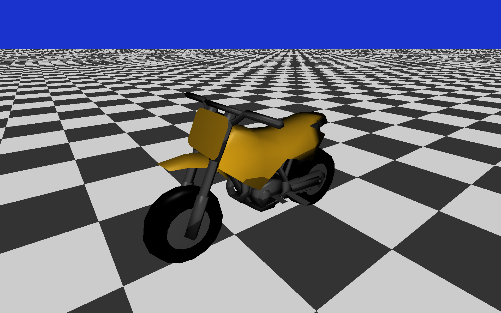
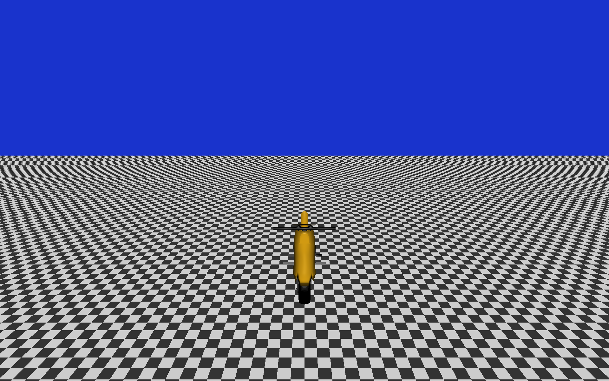
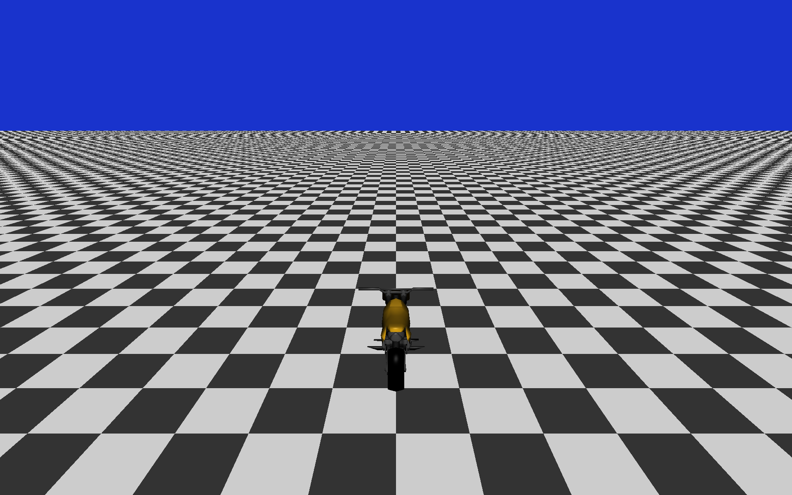

# The-Cool-Bike

In progress racing video game written in C++. This application uses OpenGL for 3d graphics and external submodules for linear algebra, asset importation, window/input management, and OpenGL function loading. \
Clone recursively:

```bash
git clone --recursive https://github.com/danwflynn/The-Cool-Bike
```

## External Dependencies

- GLFW for window and input management.
- GLAD for OpenGL function loaders.
- GLM for linear algebra, transformations, and physics.
- ASSIMP for loading model assets for rendering and hitbox generation.

## Build Project

```bash
python build.py build Debug
```

```bash
python build.py build Release
```

```bash
python build.py clean
```

CMake was the build system used for this project. I wrote a python script to handle build and clean because I'm lazy.
This project was build on Windows using the Microsoft Visual Studio Compiler but it will probably work on any system.
MyEngineCore is compiled as a static library. MyEngine, MyEngineSpectate, and MyEngineTests are all compiled as executables that
link to MyEngineCore.

## Executables

- MyEngine: runs the game with the case camera.
- MyEngineSpectate: runs the game with the ability to move around the world freely with WASD, shift, space, mouse, and controller inputs.
- MyEngineTests: runs the unit tests.

## Progress





I've implemented shaders, meshes, and model loaders for rendering. I've implemented a free view and chase camera to follow the bike. I've implemented transforms using quaternions. Transforms are used for the bike's position, rotation, scale, and hitboxes. There is a hitbox in each wheel to detect ground collision. Currently, the bike starts in the air and falls down due to gravity. The bike is angled upward so that it will land on the back wheel and then fall down to the front wheel by rotating around the collision point.
